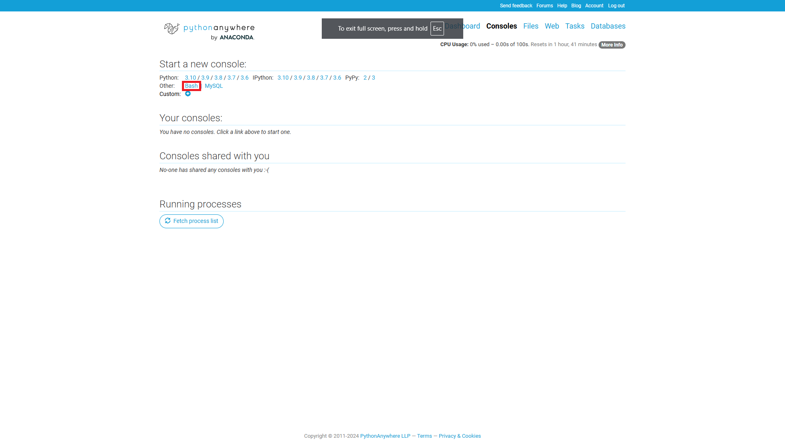

# Deploy to pythonanywhere

- create an account on [pythonanywhere.com](https://www.pythonanywhere.com/)
- to deploy your Django app follow the instructions [here](https://help.pythonanywhere.com/pages/DeployExistingDjangoProject/)
- bash console:


- ssh key:
  - create ssh keys met het commando
    ```
    ssh-keygen  
    ```
  - [voeg](https://docs.github.com/en/authentication/connecting-to-github-with-ssh/adding-a-new-ssh-key-to-your-github-account) je ssh key toe aan Github bij Settings -> SSH and GPH keys
    
  - [test](https://docs.github.com/en/authentication/connecting-to-github-with-ssh/testing-your-ssh-connection) eventueel je SSH connectie naar Github met:
    ```
    ssh -T git@github.com
    ```
   
- nu kun je met commando's ```git clone``` en ```git pull``` je repository clonen en updaten vanuit Github

## PythonAnywhere
- log in and open web tab under 'All Web apps'
- add a new webapp
- ga naar de bash console
- clone jouw repo naar pythonanywhere (via ssh)
- wijzig ALLOWED_HOSTS (vergeet de quotes niet)
- reload de web app
- je website draait nu live op het internet!