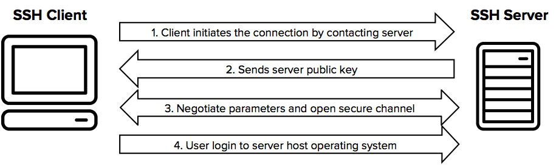

# SSH

The SSH protocol
The SSH protocol uses encryption to secure the connection between a client and a server. All user authentication, commands, output, and file transfers are encrypted to protect against attacks in the network. For details of how the SSH protocol works:

https://www.ssh.com/academy/ssh

